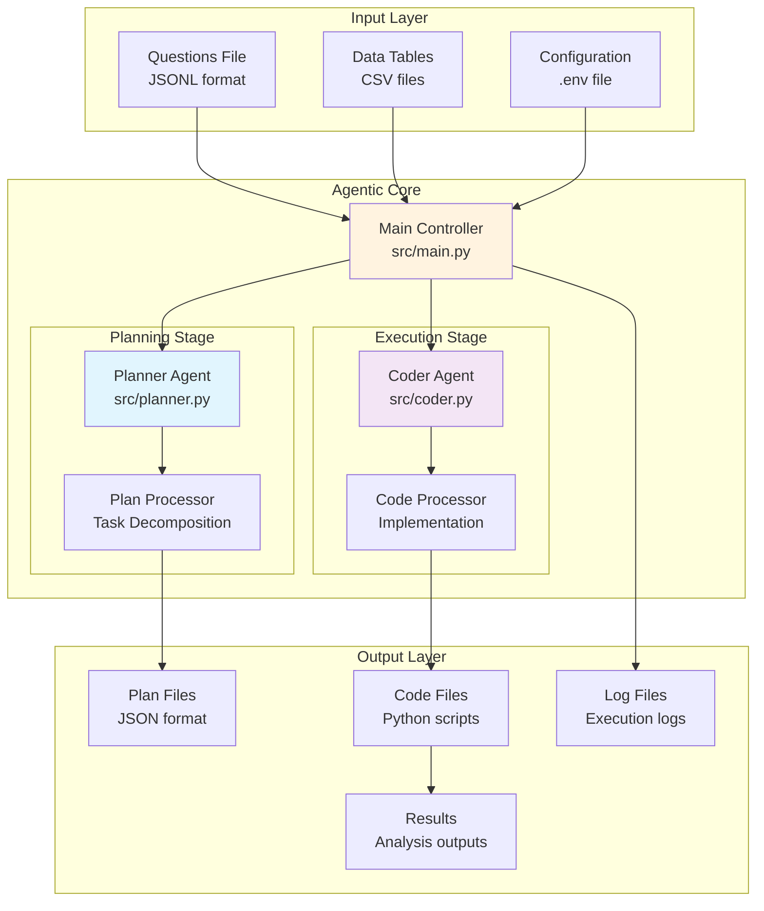
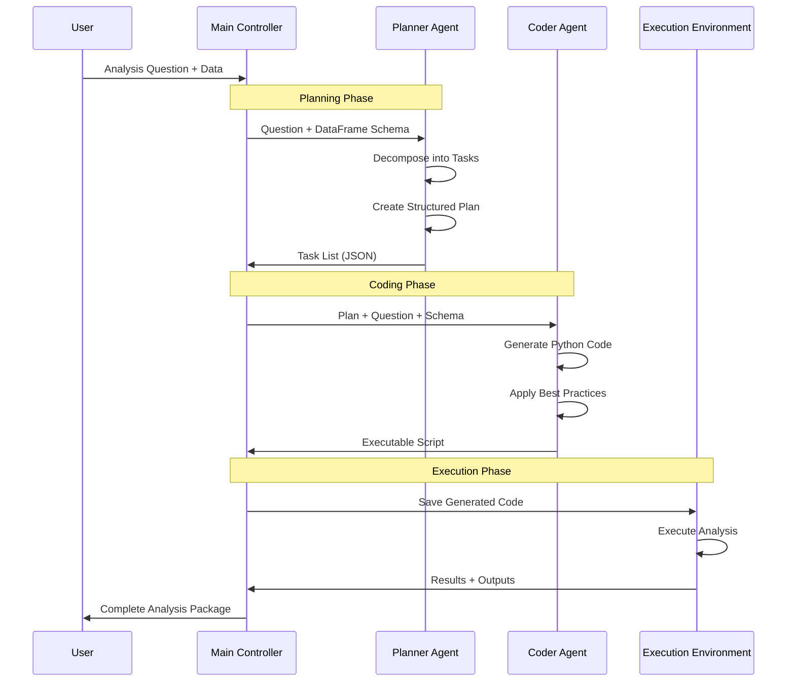
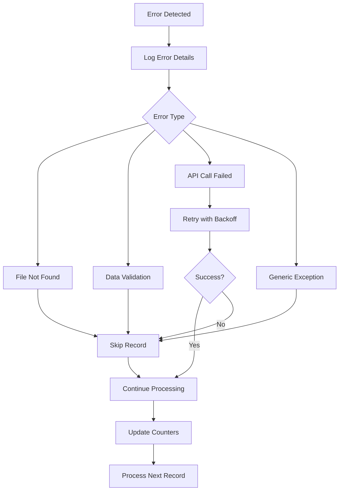

# Data Analysis Agent

A sophisticated agentic data analysis system that leverages AI to automatically plan and execute complex data analysis workflows. Built on the **plan-and-execute** agentic pattern, the system uses specialized AI agents to decompose analysis requests into structured plans and generate executable Python code.

## 🎯 Overview

The Data Analysis Agent is an intelligent system that transforms natural language data analysis questions into complete, executable Python scripts. It follows a two-stage agentic architecture where a **Planner Agent** creates detailed analysis plans and a **Coder Agent** implements them as production-ready code.

### Key Capabilities

- **🤖 Dual-Agent Architecture**: Specialized Planner and Coder agents with distinct responsibilities
- **📊 Automated Analysis Pipeline**: End-to-end processing from questions to executable code
- **🔄 Plan-and-Execute Pattern**: Systematic decomposition of complex analysis tasks
- **📈 Multi-Modal Support**: Handles various data science tasks including EDA, ML, and visualization
- **🛡️ Production-Ready**: Comprehensive error handling, logging, and validation
- **🔧 Extensible Framework**: Modular design supporting custom agents and workflows

## 🏗️ Architecture

### System Overview



### Agentic Workflow

The system implements the **plan-and-execute** pattern with two specialized agents:



### Agent Responsibilities

#### 🎯 Planner Agent (`src/planner.py`)

- **Role**: Strategic task decomposition and planning
- **Input**: Natural language questions + DataFrame metadata
- **Output**: Structured task lists with dependencies
- **Capabilities**:
  - Breaks complex requests into discrete, sequential tasks
  - Handles mandatory setup tasks (imports, configuration, logging)
  - Defines task dependencies and outputs
  - Validates plan completeness and feasibility

#### 💻 Coder Agent (`src/coder.py`)

- **Role**: Code generation and implementation
- **Input**: Structured plans + requirements
- **Output**: Production-ready Python scripts
- **Capabilities**:
  - Generates PEP 8 compliant code
  - Implements comprehensive error handling
  - Creates modular, documented functions
  - Follows data science best practices

## 🚀 Quick Start

### Prerequisites

- Python 3.13+
- OpenAI API key
- Required data files (questions, tables)

### Installation

1. **Clone and install**:

   ```bash
   git clone <repository-url>
   cd data-analysis-agent
   pip install -e .
   ```

2. **Configure environment**:

   ```bash
   cp .env.example .env
   # Edit .env with your configuration
   ```

3. **Prepare data structure**:

   ```text
   data/
   ├── InfiAgent-DABench/
   │   └── da-dev-tables/     # CSV data files
   ├── plan/                  # Generated plans (auto-created)
   └── code/                  # Generated code (auto-created)
   ```

### Basic Usage

```bash
# Standard execution
python main.py

# With options
python main.py --log-level DEBUG
python main.py --skip-cleanup
```

## 📋 Configuration

### Environment Variables

| Variable | Description | Required | Example |
|----------|-------------|----------|---------|
| `QUESTIONS_FILE` | Path to questions JSONL file | ✅ | `curated/questions.jsonl` |
| `ANSWERS_FILE` | Path to answers JSONL file | ✅ | `curated/answers.jsonl` |
| `OPENAI_API_KEY` | OpenAI API key for LLM calls | ✅ | `sk-...` |
| `LOG_LEVEL` | Logging verbosity | ❌ | `INFO` |

### Input Data Formats

#### Questions File (JSONL)

```json
{"question": "Analyze the distribution of passenger fares by class"}
{"question": "Calculate correlation between age and survival rate"}
```

#### Answers File (JSONL)

```json
{"file_name": "titanic.csv", "answer": "expected_result"}
{"file_name": "housing.csv", "answer": "correlation_value"}
```

## 🔧 Agentic Patterns

### Plan-and-Execute Pattern

The system exemplifies the plan-and-execute agentic pattern:

1. **Decomposition**: Complex analysis requests are broken into manageable tasks
2. **Planning**: Each task is specified with details, dependencies, and outputs
3. **Execution**: Plans are systematically implemented as code
4. **Validation**: Generated code includes comprehensive error handling

### Task Structure

Each plan consists of structured tasks:

```python
class Task(BaseModel):
    task_name: str          # Brief description
    details: str           # Step-by-step instructions
    dependencies: str      # Required prerequisites
    output: str           # Expected deliverables
    assumptions: str      # Clarifying assumptions
```

### Mandatory Task Sequence

Every plan begins with standardized setup tasks:

1. **Setup Imports and Dependencies**
2. **Define Configuration Constants**
3. **Setup Logging and Reproducibility**
4. **Load and Validate Input Data**
5. **Data Quality Assessment and Cleaning**
6. **Create Output Directory**

## 🔍 Detailed Workflow

### Happy Path Flow


### Error Handling Flow



## 📊 Monitoring & Observability

### Logging Framework

The system provides comprehensive logging across multiple levels:

```python
# Log file structure
data_analysis_agent.log
├── Timestamp: Process start/end
├── INFO: Progress updates and milestones
├── WARNING: Non-fatal issues and skipped records
├── ERROR: Failures with detailed context
└── DEBUG: Detailed execution traces
```

### Progress Tracking

- **Real-time updates**: Progress logged every 10 processed items
- **Success/failure counters**: Detailed metrics for each processing stage
- **Performance metrics**: Timing information for optimization

### Error Categories

| Category | Description | Action |
|----------|-------------|---------|
| **File Errors** | Missing or corrupted data files | Skip record, log warning |
| **Data Errors** | Invalid CSV structure or content | Skip record, continue processing |
| **API Errors** | LLM API failures or timeouts | Retry with exponential backoff |
| **System Errors** | Path or permission issues | Fail fast with detailed context |

## 🛠️ Development

### Project Structure

```text
data-analysis-agent/
├── main.py                 # Entry point for main controller
├── async_main.py           # Entry point for async controller
├── setup_notebook_path.py  # Helper for notebook imports
├── src/                    # Source code directory
│   ├── main.py             # Main controller and orchestration
│   ├── async_main.py       # Async controller implementation
│   ├── planner.py          # Planner Agent implementation
│   ├── coder.py            # Coder Agent implementation
│   ├── prompts.py          # System prompts for agents
│   ├── paths.py            # Centralized path management
│   ├── dataframe_to_dict.py # Schema generation utilities
│   └── __init__.py         # Package initialization
├── pyproject.toml          # Project configuration
├── data/                   # Data directory
│   ├── plan/               # Generated analysis plans
│   ├── code/               # Generated Python scripts
│   └── InfiAgent-DABench/  # Input datasets
└── notebooks/              # Development notebooks
    ├── planner.ipynb       # Planner development
    ├── coder.ipynb         # Coder development
    └── full_run.ipynb      # End-to-end testing
```

### Key Components

#### Path Management (`paths.py`)

Centralized path resolution ensuring consistency:

- Auto-detects project root
- Resolves relative paths absolutely
- Manages directory creation and cleanup

#### Prompt Engineering (`prompts.py`)

Carefully crafted system prompts for:

- **Planner**: Task decomposition guidelines
- **Coder**: Implementation standards and constraints

#### Schema Generation (`dataframe_to_dict.py`)

Converts DataFrame metadata to structured JSON for agent consumption

### Extending the System

#### Adding New Agents

1. **Create agent module**:

   ```python
   class NewAgent:
       def __init__(self):
           self.llm = init_chat_model("openai:gpt-4")
       
       def process(self, input_data):
           # Implementation
           pass
   ```

2. **Update main controller**:

   ```python
   def process_new_stage(df_merged):
       new_agent = NewAgent()
       # Process data
       return updated_df
   ```

3. **Add configuration**:
   - Update `paths.py` for new directories
   - Add prompts to `prompts.py`
   - Update main workflow in `src/main.py`

## 📈 Performance & Scaling

### Throughput Metrics

- **Planning**: ~10-20 questions per minute (depends on complexity)
- **Coding**: ~5-15 plans per minute (depends on plan size)
- **Memory Usage**: ~100-500MB per dataset (varies by CSV size)

### Optimization Strategies

1. **Batch Processing**: Process multiple items before I/O operations
2. **Parallel Execution**: Future enhancement for concurrent agent calls
3. **Caching**: Plan and code caching for repeated patterns
4. **Resource Management**: Automatic cleanup and memory optimization

### Error Recovery

- **Graceful Degradation**: Continue processing despite individual failures
- **Retry Logic**: Configurable retry attempts for API calls
- **State Preservation**: Maintain progress across partial runs
- **Resume Capability**: Skip completed items on restart

## 🧪 Testing & Validation

### Quality Assurance

The system includes multiple validation layers:

1. **Input Validation**: Environment variables, file existence, data integrity
2. **Schema Validation**: Pydantic models for structured data
3. **Code Validation**: Syntax checking and best practice enforcement
4. **Output Validation**: Result verification and completeness checks

### Development Notebooks

- **`planner.ipynb`**: Interactive planner development and testing
- **`coder.ipynb`**: Code generation experimentation
- **`full_run.ipynb`**: End-to-end system validation

## 🔧 Command Line Interface

```bash
# Basic usage
python main.py

# Advanced options
python main.py \
    --log-level DEBUG \
    --skip-cleanup
```

### Available Options

| Option | Description | Default |
|--------|-------------|---------|
| `--skip-cleanup` | Preserve existing output files | `False` |
| `--log-level` | Set logging verbosity | `INFO` |

## 🚀 Future Enhancements

### Planned Features

- **Multi-Model Support**: Support for additional LLM providers
- **Interactive Mode**: Real-time question-answering interface
- **Result Validation**: Automated testing of generated code
- **Performance Optimization**: Parallel processing and caching
- **Web Interface**: Browser-based interaction and monitoring
- **Custom Agents**: Framework for domain-specific analysis agents

### Research Directions

- **Plan Optimization**: Learning from execution feedback
- **Code Quality Metrics**: Automated code review and improvement
- **Domain Adaptation**: Specialized agents for specific data science domains
- **Explainable AI**: Transparent decision making in plan generation

## 🤝 Contributing

Contributions are welcome! Please see our contributing guidelines for:

- Code style and standards
- Testing requirements
- Documentation expectations
- Pull request process

## 📄 License

This project is licensed under the MIT License - see the [LICENSE](LICENSE) file for details.
