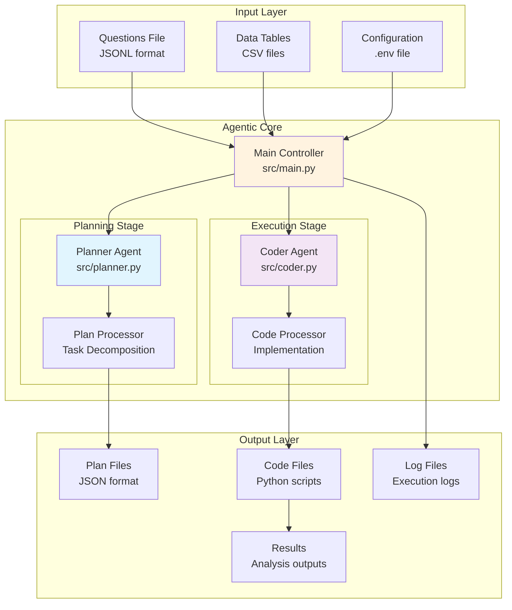
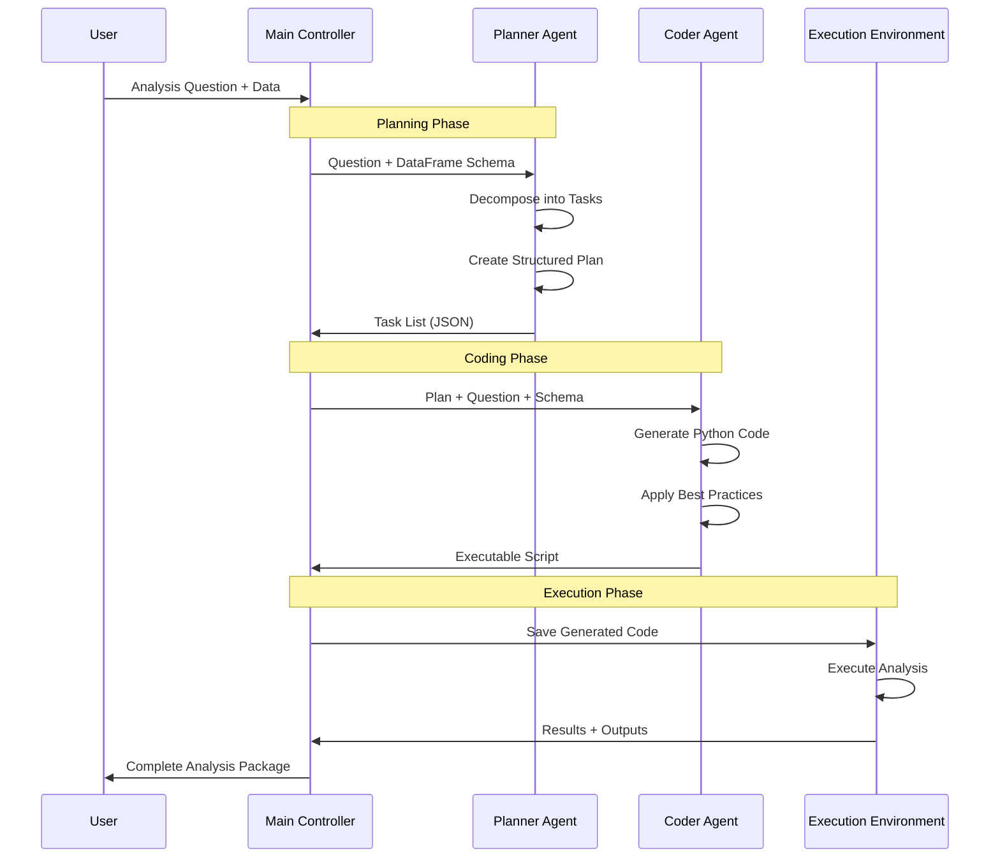
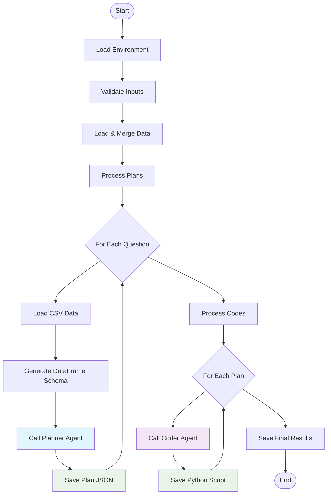
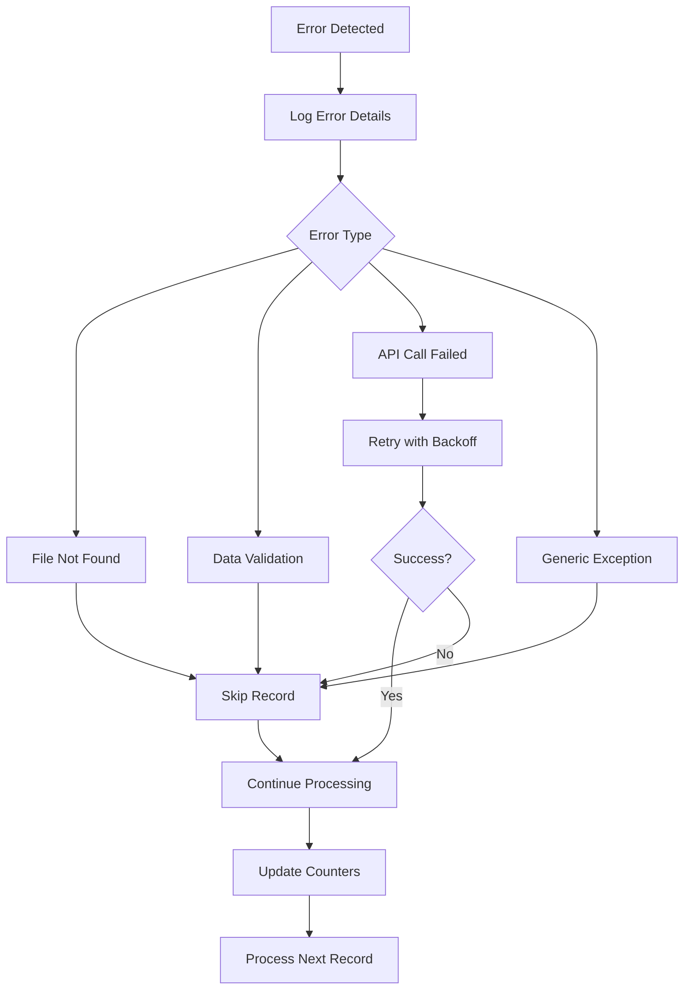

# Data Analysis Agent

A sophisticated agentic data analysis system that leverages AI to automatically plan and execute complex data analysis workflows. Built on the **plan-and-execute** agentic pattern, the system uses specialized AI agents to decompose analysis requests into structured plans and generate executable Python code.

## 🎯 Overview

The Data Analysis Agent is an intelligent system that transforms natural language data analysis questions into complete, executable Python scripts. It follows a two-stage agentic architecture where a **Planner Agent** creates detailed analysis plans and a **Coder Agent** implements them as production-ready code.

### Key Capabilities

- **🤖 Dual-Agent Architecture**: Specialized Planner and Coder agents with distinct responsibilities
- **📊 Automated Analysis Pipeline**: End-to-end processing from questions to executable code
- **🔄 Plan-and-Execute Pattern**: Systematic decomposition of complex analysis tasks
- **📈 Multi-Modal Support**: Handles various data science tasks including EDA, ML, and visualization
- **🛡️ Production-Ready**: Comprehensive error handling, logging, and validation
- **🔧 Extensible Framework**: Modular design supporting custom agents and workflows
- **🧪 Comprehensive Testing**: Extensive test suite ensuring reliability and maintainability

## 🏗️ Architecture

### System Overview



### Agentic Workflow

The system implements the **plan-and-execute** pattern with two specialized agents:



### Agent Responsibilities

#### 🎯 Planner Agent (`src/planner.py`)

- **Role**: Strategic task decomposition and planning
- **Input**: Natural language questions + DataFrame metadata
- **Output**: Structured task lists with dependencies
- **Capabilities**:
  - Breaks complex requests into discrete, sequential tasks
  - Handles mandatory setup tasks (imports, configuration, logging)
  - Defines task dependencies and outputs
  - Validates plan completeness and feasibility

#### 💻 Coder Agent (`src/coder.py`)

- **Role**: Code generation and implementation
- **Input**: Structured plans + requirements
- **Output**: Production-ready Python scripts
- **Capabilities**:
  - Generates PEP 8 compliant code
  - Implements comprehensive error handling
  - Creates modular, documented functions
  - Follows data science best practices

## 🚀 Quick Start

### Prerequisites

- **Python 3.13+** (required)
- **OpenAI API key** for LLM functionality
- **uv** (recommended) or **pip** for package management

### Installation

#### Option 1: Using uv (Recommended)

```bash
# Clone the repository
git clone <repository-url>
cd data-analysis-agent

# Install with uv in development mode
uv pip install -e .

# Install development dependencies (for testing)
uv pip install -e ".[dev]"
```

#### Option 2: Using pip

```bash
# Clone the repository
git clone <repository-url>
cd data-analysis-agent

# Create and activate virtual environment
python -m venv .venv
source .venv/bin/activate  # On Windows: .venv\Scripts\activate

# Install in development mode
pip install -e .

# Install development dependencies (for testing)
pip install -e ".[dev]"
```

### Environment Configuration

1. **Create environment file**:

   ```bash
   cp .env.example .env
   ```

2. **Configure your `.env` file**:

   ```env
   # Required: OpenAI API configuration
   OPENAI_API_KEY=sk-your-openai-api-key-here
   
   # Required: Input data files
   QUESTIONS_FILE=curated/questions.jsonl
   ANSWERS_FILE=curated/answers.jsonl
   
   # Optional: Logging configuration
   LOG_LEVEL=INFO
   ```

3. **Prepare data structure**:

   ```text
   data/
   ├── InfiAgent-DABench/
   │   ├── da-dev-questions.jsonl  # Questions file
   │   ├── da-dev-labels.jsonl     # Expected answers
   │   └── da-dev-tables/          # CSV data files
   ├── plan/                       # Generated plans (auto-created)
   └── code/                       # Generated code (auto-created)
   ```

### Running the Application

#### Using the Command Line Interface

```bash
# Standard execution with default settings
data-analysis-agent

# Or using Python module directly
python -m data_analysis_agent.cli

# With custom log level
data-analysis-agent --log-level DEBUG

# Skip cleanup of existing files
data-analysis-agent --skip-cleanup

# Async version for better performance
data-analysis-agent-async
```

#### Using Python Scripts (Legacy)

```bash
# Main synchronous version
python main.py

# Async version
python async_main.py

# With options
python main.py --log-level DEBUG --skip-cleanup
```

### Running Tests

The project includes a comprehensive test suite covering all major components:

```bash
# Run all tests
pytest

# Run tests with verbose output
pytest -v

# Run specific test files
pytest tests/test_paths.py
pytest tests/test_planner.py

# Run tests with coverage reporting
pytest --cov=data_analysis_agent

# Run tests matching a pattern
pytest -k "test_paths"

# Run tests requiring API key (integration tests)
pytest -m "requires_api_key"

# Skip integration tests (if no API key available)
pytest -m "not requires_api_key"
```

### Development and Testing Workflow

```bash
# 1. Set up development environment
git clone <repository-url>
cd data-analysis-agent
uv pip install -e ".[dev]"

# 2. Configure environment
cp .env.example .env
# Edit .env with your configuration

# 3. Run tests to verify setup
pytest

# 4. Run the application
data-analysis-agent

# 5. Development cycle
# - Make changes to code
# - Run relevant tests: pytest tests/test_<module>.py
# - Run full test suite: pytest
# - Commit changes
```

## 📋 Configuration

### Environment Variables

| Variable | Description | Required | Example |
|----------|-------------|----------|---------|
| `QUESTIONS_FILE` | Path to questions JSONL file | ✅ | `curated/questions.jsonl` |
| `ANSWERS_FILE` | Path to answers JSONL file | ✅ | `curated/answers.jsonl` |
| `OPENAI_API_KEY` | OpenAI API key for LLM calls | ✅ | `sk-...` |
| `LOG_LEVEL` | Logging verbosity | ❌ | `INFO` |

### Input Data Formats

#### Questions File (JSONL)

```json
{"question": "Analyze the distribution of passenger fares by class"}
{"question": "Calculate correlation between age and survival rate"}
```

#### Answers File (JSONL)

```json
{"file_name": "titanic.csv", "answer": "expected_result"}
{"file_name": "housing.csv", "answer": "correlation_value"}
```

## 🔧 Agentic Patterns

### Plan-and-Execute Pattern

The system exemplifies the plan-and-execute agentic pattern:

1. **Decomposition**: Complex analysis requests are broken into manageable tasks
2. **Planning**: Each task is specified with details, dependencies, and outputs
3. **Execution**: Plans are systematically implemented as code
4. **Validation**: Generated code includes comprehensive error handling

### Task Structure

Each plan consists of structured tasks:

```python
class Task(BaseModel):
    task_name: str          # Brief description
    details: str           # Step-by-step instructions
    dependencies: str      # Required prerequisites
    output: str           # Expected deliverables
    assumptions: str      # Clarifying assumptions
```

### Mandatory Task Sequence

Every plan begins with standardized setup tasks:

1. **Setup Imports and Dependencies**
2. **Define Configuration Constants**
3. **Setup Logging and Reproducibility**
4. **Load and Validate Input Data**
5. **Data Quality Assessment and Cleaning**
6. **Create Output Directory**

## 🔍 Detailed Workflow

### Happy Path Flow



### Error Handling Flow



## 📊 Monitoring & Observability

### Logging Framework

The system provides comprehensive logging across multiple levels:

```python
# Log file structure
data_analysis_agent.log
├── Timestamp: Process start/end
├── INFO: Progress updates and milestones
├── WARNING: Non-fatal issues and skipped records
├── ERROR: Failures with detailed context
└── DEBUG: Detailed execution traces
```

### Progress Tracking

- **Real-time updates**: Progress logged every 10 processed items
- **Success/failure counters**: Detailed metrics for each processing stage
- **Performance metrics**: Timing information for optimization

### Error Categories

| Category | Description | Action |
|----------|-------------|---------|
| **File Errors** | Missing or corrupted data files | Skip record, log warning |
| **Data Errors** | Invalid CSV structure or content | Skip record, continue processing |
| **API Errors** | LLM API failures or timeouts | Retry with exponential backoff |
| **System Errors** | Path or permission issues | Fail fast with detailed context |

## 🛠️ Development

### Project Structure

```text
data-analysis-agent/
├── pyproject.toml              # Project configuration and dependencies
├── main.py                     # Legacy entry point (sync)
├── async_main.py              # Legacy entry point (async)
├── setup_notebook_path.py     # Helper for notebook imports
├── data_analysis_agent/       # Main package directory
│   ├── __init__.py           # Package initialization
│   ├── cli.py                # Command-line interface (sync)
│   ├── async_cli.py          # Command-line interface (async)
│   ├── planner.py            # Planner Agent implementation
│   ├── coder.py              # Coder Agent implementation
│   ├── prompts.py            # System prompts for agents
│   ├── paths.py              # Centralized path management
│   ├── dataframe_to_dict.py  # Schema generation utilities
│   ├── dataframe_time.py     # Time-based analysis utilities
│   ├── point_geom.py         # Geometry utilities
│   └── data_quality_assessment.py # Data quality tools
├── tests/                     # Comprehensive test suite
│   ├── __init__.py           # Test package init
│   ├── conftest.py           # Pytest configuration and fixtures
│   ├── test_paths.py         # Tests for path management
│   ├── test_planner.py       # Tests for planner functionality
│   └── assets/               # Test data and fixtures
├── data/                      # Data directory (created at runtime)
│   ├── plan/                 # Generated analysis plans
│   ├── code/                 # Generated Python scripts
│   ├── InfiAgent-DABench/    # Input datasets
│   └── data_analysis_agent.log # Application logs
├── curated/                   # Curated datasets and examples
└── notebooks/                 # Development and exploration notebooks
    ├── planner.ipynb         # Planner development
    ├── coder.ipynb           # Coder development
    ├── full_run.ipynb        # End-to-end testing
    ├── graph.ipynb           # Graph analysis
    ├── pre_process.ipynb     # Data preprocessing
    └── questions.ipynb       # Question analysis
```

### Key Components

#### Path Management (`data_analysis_agent/paths.py`)

Centralized path resolution ensuring consistency across the application:

- **Auto-detects project root** from package location
- **Resolves relative paths** to absolute paths consistently  
- **Manages directory creation** and cleanup operations
- **Singleton pattern** ensures consistent path usage
- **Cross-platform compatibility** for Windows/Unix systems

**Key Features:**

```python
from data_analysis_agent.paths import get_paths

paths = get_paths()
print(paths.data_dir)      # /path/to/project/data
print(paths.plan_dir)      # /path/to/project/data/plan
print(paths.code_dir)      # /path/to/project/data/code
paths.ensure_directories() # Creates all necessary directories
```

#### Prompt Engineering (`data_analysis_agent/prompts.py`)

Carefully crafted system prompts optimized for each agent:

- **Planner prompts**: Task decomposition guidelines and structured output
- **Coder prompts**: Implementation standards, best practices, and constraints
- **Template-based**: Consistent formatting and clear instructions
- **Context-aware**: Incorporates data schema and requirements

#### Automotive Data Quality Assessment (`data_analysis_agent/automotive_data_quality.py`)

Specialized framework for automotive telemetry data quality assessment with domain-specific validation:

- **Signal Type Detection**: Automatic identification of automotive signals (RPM, speed, temperature, etc.)
- **Range Validation**: Soft and hard range checking with powertrain-specific limits
- **Conditional Signal Analysis**: Detection of signals active only under certain conditions
- **Temporal Consistency**: Validation of physically possible value changes over time
- **Cross-Signal Plausibility**: Correlation checks between related signals (wheel vs vehicle speed)
- **CAN Bus Signal Support**: Specialized handling for automotive communication protocols
- **Signal Dictionary Integration**: Enhanced reporting with signal metadata and units

**Key Features:**

```python
from data_analysis_agent.automotive_data_quality import generate_automotive_quality_report

# Generate comprehensive quality report
text_report, json_data = generate_automotive_quality_report(
    df,
    json_output_file='quality_report.json',  # Optional: save JSON output
    output_file='quality_report.txt',        # Optional: save text output
    silent=None,                             # Auto-silent when files specified
    correlation_threshold=0.95,              # Threshold for reporting correlations
    include_all_correlations=False           # Show only unexpected correlations
)

# Silent mode for automated workflows (no console output)
generate_automotive_quality_report(df, json_output_file='report.json')  # Auto-silent

# Force output even when saving to files
generate_automotive_quality_report(df, json_output_file='report.json', silent=False)
```

**Output Modes:**

- **Normal**: Returns `(text_report, json_data)` tuple with console output
- **Silent**: Returns `None` when files are written, suppressing console output
- **Hybrid**: Returns `(None, json_data)` for programmatic access without console display

#### Schema Generation (`data_analysis_agent/dataframe_to_dict.py`)

Intelligent DataFrame metadata extraction for agent consumption:

- **Column type detection**: Automatic data type inference
- **Schema serialization**: JSON format for LLM processing
- **Metadata preservation**: Maintains important DataFrame information
- **Error handling**: Robust parsing of various DataFrame formats

#### Testing Framework (`tests/`)

Comprehensive test coverage ensuring system reliability:

```python
# Run specific test categories
pytest tests/test_paths.py      # Path management tests (30 tests)
pytest tests/test_planner.py    # Planner functionality tests (10 tests)

# Test with different configurations
pytest --log-level DEBUG       # Verbose test output
pytest -m "not requires_api_key" # Skip API-dependent tests
pytest --cov=data_analysis_agent # Coverage reporting
```

**Test Categories:**

- **Unit Tests**: Individual component testing with mocked dependencies
- **Integration Tests**: End-to-end workflows with real LLM calls
- **Fixtures**: Reusable test data and configurations
- **Error Handling**: Comprehensive error condition testing

### Extending the System

#### Adding New Agents

1. **Create agent module**:

   ```python
   class NewAgent:
       def __init__(self):
           self.llm = init_chat_model("openai:gpt-4")
       
       def process(self, input_data):
           # Implementation
           pass
   ```

2. **Update main controller**:

   ```python
   def process_new_stage(df_merged):
       new_agent = NewAgent()
       # Process data
       return updated_df
   ```

3. **Add configuration**:
   - Update `paths.py` for new directories
   - Add prompts to `prompts.py`
   - Update main workflow in `src/main.py`

## 📈 Performance & Scaling

### Throughput Metrics

- **Planning**: ~10-20 questions per minute (depends on complexity)
- **Coding**: ~5-15 plans per minute (depends on plan size)
- **Memory Usage**: ~100-500MB per dataset (varies by CSV size)

### Optimization Strategies

1. **Batch Processing**: Process multiple items before I/O operations
2. **Parallel Execution**: Future enhancement for concurrent agent calls
3. **Caching**: Plan and code caching for repeated patterns
4. **Resource Management**: Automatic cleanup and memory optimization

### Error Recovery

- **Graceful Degradation**: Continue processing despite individual failures
- **Retry Logic**: Configurable retry attempts for API calls
- **State Preservation**: Maintain progress across partial runs
- **Resume Capability**: Skip completed items on restart

## 🧪 Testing & Quality Assurance

### Testing Strategy

The project employs a comprehensive testing strategy to ensure reliability and maintainability:

#### Test Structure

```text
tests/
├── conftest.py              # Pytest configuration and shared fixtures
├── test_paths.py           # Path management tests (30 test cases)
├── test_planner.py         # Planner agent tests (10 test cases)
└── assets/                 # Test data and sample files
    ├── test_data.csv       # Sample CSV files for testing
    └── sample_questions.jsonl # Test question sets
```

#### Test Categories

1. **Unit Tests**: Individual component testing with isolated functionality
   - Path resolution and management
   - Data schema generation
   - Configuration validation
   - Error handling mechanisms

2. **Integration Tests**: End-to-end workflow validation
   - Complete planner-to-coder workflows
   - Real LLM API interactions (with API key)
   - File I/O operations and data persistence

3. **Fixture-Based Tests**: Reusable test components
   - Temporary directory creation
   - Mock data generation
   - Environment simulation

#### Test Execution Commands

```bash
# Complete test suite
pytest                       # All tests
pytest -v                   # Verbose output
pytest --tb=short           # Shorter traceback format

# Coverage analysis
pytest --cov=data_analysis_agent                    # Basic coverage
pytest --cov=data_analysis_agent --cov-report=html  # HTML report
pytest --cov=data_analysis_agent --cov-report=term-missing # Missing lines

# Selective testing
pytest tests/test_paths.py                    # Specific module
pytest tests/test_planner.py::TestTask       # Specific test class
pytest -k "test_initialization"              # Pattern matching
pytest -m "not requires_api_key"             # Skip API tests
pytest -m "integration"                      # Integration tests only

# Parallel execution (if pytest-xdist installed)
pytest -n auto              # Auto-detect CPU cores
pytest -n 4                 # Use 4 parallel workers

# Automotive quality tests
pytest tests/test_automotive_quality.py                    # Basic automotive tests
pytest tests/test_enhanced_automotive_quality.py           # Enhanced automotive tests
pytest -k "silent"                                         # Silent mode tests only
```

#### Test Configuration

The project uses `pyproject.toml` for test configuration:

```toml
[tool.pytest.ini_options]
testpaths = ["tests"]
python_files = ["test_*.py", "*_test.py"]
python_classes = ["Test*"]
python_functions = ["test_*"]
addopts = ["-v", "--tb=short", "--strict-markers"]
```

### Quality Assurance

#### Automated Validation Layers

1. **Input Validation**: Environment variables, file existence, data integrity
2. **Schema Validation**: Pydantic models for structured data consistency
3. **Code Validation**: Syntax checking and best practice enforcement
4. **Output Validation**: Result verification and completeness checks
5. **Error Handling**: Graceful degradation and recovery mechanisms

#### Development Quality Gates

```bash
# Pre-commit quality checks
pytest                       # All tests must pass
pytest --cov=data_analysis_agent --cov-fail-under=80  # Minimum 80% coverage
# Add linting when configured (e.g., black, flake8, mypy)
```

#### Continuous Integration Readiness

The test suite is designed for CI/CD integration:

- **Fast unit tests**: Run in seconds for quick feedback
- **Isolated integration tests**: Marked separately for selective execution
- **Environment flexibility**: Tests work with or without API keys
- **Comprehensive coverage**: All critical paths validated

### Development Notebooks

- **`planner.ipynb`**: Interactive planner development and testing
- **`coder.ipynb`**: Code generation experimentation
- **`full_run.ipynb`**: End-to-end system validation

## 🔧 Command Line Interface

### Available Commands

The project provides multiple ways to run the data analysis agent:

#### Primary Commands (Recommended)

```bash
# Main command-line interface (synchronous)
data-analysis-agent [options]

# Async command-line interface (better performance)
data-analysis-agent-async [options]

# Using Python module directly
python -m data_analysis_agent.cli [options]
python -m data_analysis_agent.async_cli [options]
```

#### Legacy Commands

```bash
# Legacy Python scripts (still supported)
python main.py [options]
python async_main.py [options]
```

### Command Line Options

| Option | Description | Default | Example |
|--------|-------------|---------|---------|
| `--log-level` | Set logging verbosity | `INFO` | `--log-level DEBUG` |
| `--skip-cleanup` | Preserve existing output files | `False` | `--skip-cleanup` |

### Usage Examples

```bash
# Standard execution with default settings
data-analysis-agent

# Debug mode with verbose logging
data-analysis-agent --log-level DEBUG

# Preserve existing files (don't clean output directories)
data-analysis-agent --skip-cleanup

# Async execution for better performance with large datasets
data-analysis-agent-async --log-level INFO

# Development testing with legacy scripts
python main.py --log-level DEBUG --skip-cleanup
```

### Testing Commands

```bash
# Run all tests
pytest

# Run tests with verbose output and coverage
pytest -v --cov=data_analysis_agent

# Run specific test modules
pytest tests/test_paths.py -v
pytest tests/test_planner.py -v

# Run tests by category
pytest -m "not requires_api_key"  # Skip API tests
pytest -m "requires_api_key"      # Only API tests

# Run tests with custom markers
pytest -k "test_path" -v          # Tests matching pattern
```

## 🚀 Future Enhancements

### Planned Features

#### Near-term (Next Release)

- **Enhanced Test Coverage**: Expand test suite to include coder and integration components
- **Configuration Management**: More flexible environment and runtime configuration
- **Error Recovery**: Improved retry mechanisms and state preservation
- **Performance Optimization**: Caching and parallel processing capabilities

#### Medium-term

- **Multi-Model Support**: Support for additional LLM providers (Anthropic, Azure OpenAI)
- **Interactive Mode**: Real-time question-answering interface and chat-based interaction
- **Result Validation**: Automated testing and verification of generated code
- **Web Interface**: Browser-based interaction, monitoring, and result visualization

#### Long-term

- **Custom Agents**: Framework for domain-specific analysis agents
- **Plan Optimization**: Learning from execution feedback and performance metrics
- **Advanced Analytics**: Statistical validation and automated insight generation
- **Enterprise Features**: Multi-user support, audit trails, and governance

### Development Priorities

1. **Testing Infrastructure**: Complete test coverage for all components
2. **Documentation**: API documentation and developer guides
3. **Performance**: Benchmarking and optimization of LLM interactions
4. **Reliability**: Enhanced error handling and recovery mechanisms
5. **Usability**: Improved CLI interface and user experience

### Research Directions

- **Plan Optimization**: Learning optimal task decomposition patterns
- **Code Quality Metrics**: Automated code review and improvement suggestions
- **Domain Adaptation**: Specialized agents for finance, healthcare, science domains
- **Explainable AI**: Transparent decision making and reasoning chains

## 🔧 Troubleshooting

### Common Issues and Solutions

#### Installation Issues

**Problem**: `uv` command not found

```bash
# Solution: Install uv
curl -LsSf https://astral.sh/uv/install.sh | sh  # Unix/macOS
# Or visit https://docs.astral.sh/uv/getting-started/installation/
```

**Problem**: Package installation fails with dependency conflicts

```bash
# Solution: Use clean virtual environment
uv venv
source .venv/bin/activate  # Unix/macOS
# or .venv\Scripts\activate  # Windows
uv pip install -e ".[dev]"
```

#### Runtime Issues

**Problem**: `OPENAI_API_KEY` not found

```bash
# Solution: Check environment configuration
cp .env.example .env
# Edit .env file and add your API key
```

**Problem**: Questions or data files not found

```bash
# Solution: Verify file paths in .env
QUESTIONS_FILE=curated/questions.jsonl  # Relative to project root
ANSWERS_FILE=curated/answers.jsonl      # Relative to project root
```

**Problem**: Permission errors when creating directories

```bash
# Solution: Check directory permissions
ls -la data/  # Unix/macOS
# Ensure write permissions for data directory
```

#### Testing Issues

**Problem**: Tests fail with API key requirements

```bash
# Solution: Skip API-dependent tests
pytest -m "not requires_api_key"

# Or set test API key
export OPENAI_API_KEY="test-key-for-unit-tests"
```

**Problem**: Import errors during testing

```bash
# Solution: Install in development mode
pip install -e ".[dev]"
# Or ensure PYTHONPATH includes project root
```

#### Performance Issues

**Problem**: Slow LLM responses

```bash
# Solution: Use async version for better performance
data-analysis-agent-async

# Or reduce request complexity in prompts
```

**Problem**: Memory issues with large datasets

```bash
# Solution: Process data in smaller batches
# Consider implementing chunking in future versions
```

### Getting Help

1. **Check Logs**: Look at `data/data_analysis_agent.log` for detailed error information
2. **Enable Debug Mode**: Run with `--log-level DEBUG` for verbose output
3. **Test Setup**: Run `pytest tests/test_paths.py -v` to verify basic functionality
4. **Environment**: Verify all required environment variables are set correctly

### Contributing to Troubleshooting

If you encounter issues not covered here:

1. Check existing GitHub issues
2. Create a new issue with:
   - Error message and full traceback
   - Environment details (OS, Python version, package versions)
   - Steps to reproduce
   - Log file contents (if relevant)

## 🤝 Contributing

Contributions are welcome! Please follow these guidelines:

### Development Setup

```bash
# 1. Fork and clone the repository
git clone <your-fork-url>
cd data-analysis-agent

# 2. Set up development environment
uv pip install -e ".[dev]"

# 3. Create feature branch
git checkout -b feature/your-feature-name

# 4. Make changes and test
pytest  # Ensure all tests pass

# 5. Submit pull request
```

### Code Standards

- **Testing**: All new code must include comprehensive tests
- **Documentation**: Update README and docstrings for new features
- **Style**: Follow existing code patterns and conventions
- **Commits**: Use clear, descriptive commit messages

### Pull Request Process

1. Ensure all tests pass locally
2. Update documentation for new features
3. Add entry to changelog if applicable
4. Request review from maintainers

## 📄 License

This project is licensed under the MIT License - see the [LICENSE](LICENSE) file for details.
